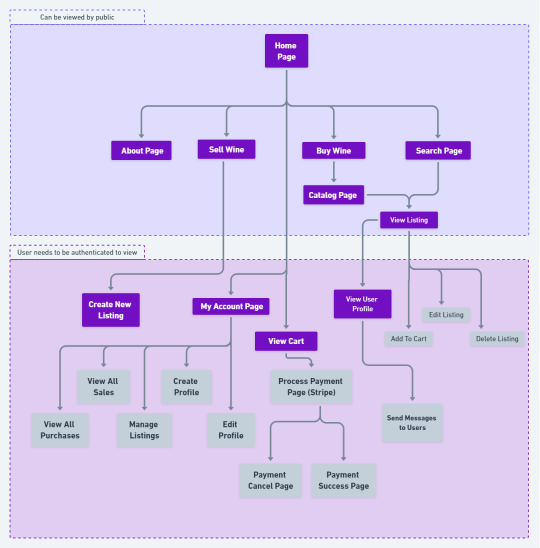
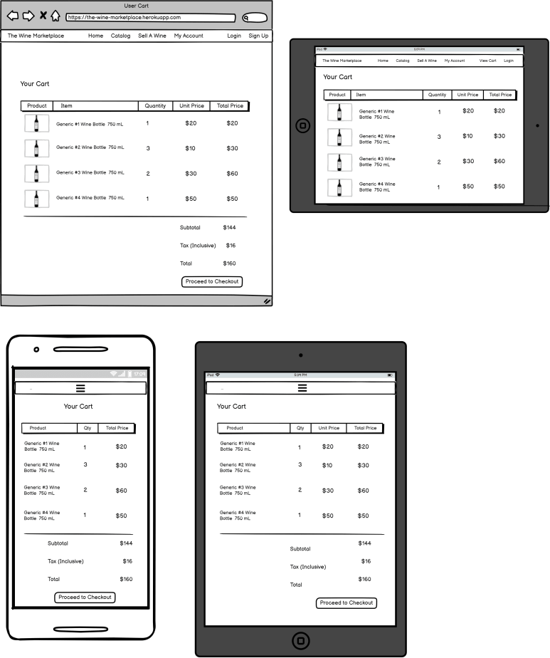
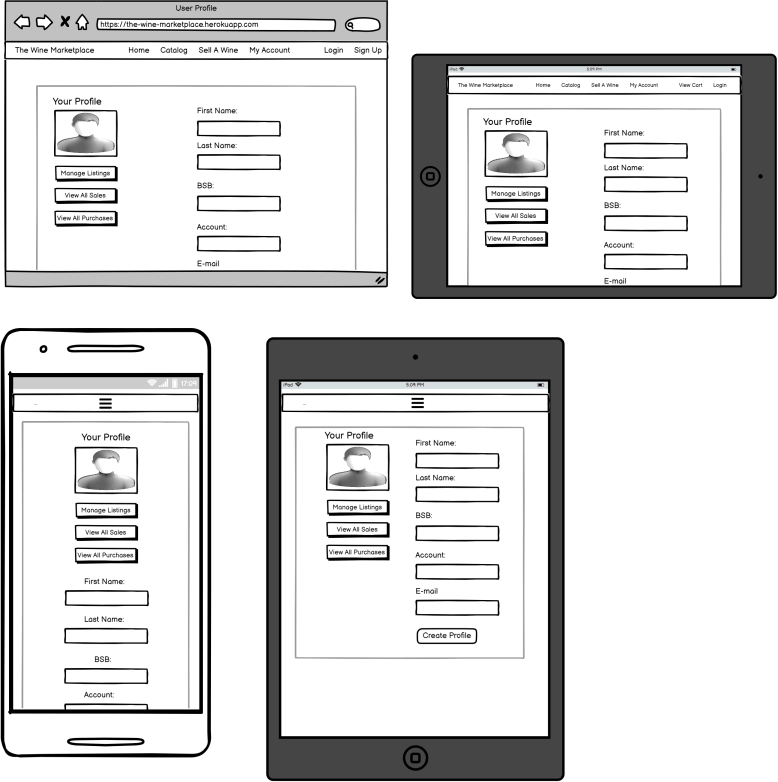
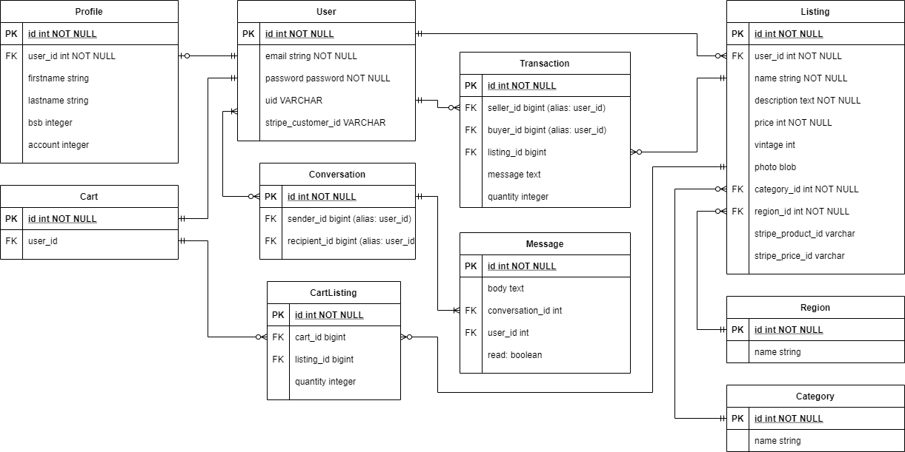
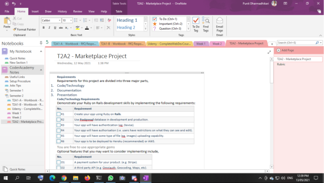
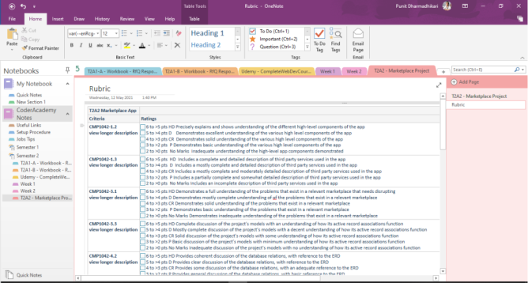
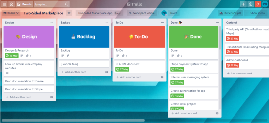

# **Punit Dharmadhikari T2A2 Marketplace Project**

### **R1: Create your app using Ruby on Rails.**

✅ The application is built using Ruby on Rails framework.


### **R2: Use Postgresql database in development and production.**

✅ The application uses the PostgreSQL database.


### **R3: Your app will have authentication (eg. Devise).**

✅ The application uses Devise for user authentication.

### **R4: Your app will have authorisation (i.e. users have restrictions on what they can see and edit).**

✅ The application restricts users on what they can see and edit. This was done both manually and using Pundit gem.

### **R5: Your app will have some type of file (eg. images) uploading capability.**

✅ The application allows image upload of wine listings and also for user profile photos.


### **R6: Your app is to be deployed to Heroku (recommended) or AWS.**

✅ The application is deployed to Heroku.

### **O1: A payment system for your product. (e.g. Stripe).**

✅ The application uses Stripe for payments.

### **O2: A third party API (e.g. Omniauth, Geocoding, Maps, etc).**

✅ The application uses Stripe Webhook API.

### **O4: Searching, sorting and/or filtering capability.**

✅ The application has a search bar that users can use to search for wine.

### **O5: Internal user messaging system within the app.**

✅ The application offers an internal messaging system between different users.


### **R7: Identification of the problem you are trying to solve by building this particular marketplace app.**

The wine industry in Australia is booming – Australia is now the sixth largest producer of wine worldwide, exporting both domestically and internationally. Based on my personal experience of working in the industry, I have observed a significant customer base for rare wines, either for collection or drinking. The wines they purchase can range in price from a few hundred to a few thousand dollars. This valuable group with high levels of disposable income forms the target customer base for the website.

There are many factors that determine the price of a bottle of wine, from the quality of the grapes to the year of the harvest. When grapes are harvested during a ‘good year’ the wine acquires a taste that cannot be replicated again. The wines from a particular year (known as ‘vintages’) can gain cult followings due to their rarity, and turn into collector items. Customers in the market for these rare wines are often dedicated and will spend a great deal of time and effort trying to purchase these products. 

The website exists as a basic marketplace that allows users to create a profile to either buy or sell wine (or both), create and edit a listing, upload a photo of the product, set the price and collect payments. The chat function allows buyers to communicate with sellers. 

The site is designed with user engagement in mind, with a clear and attractive design for beneficial UX. Wine buyers can often be discerning customers, and it is important that the site design and functionality meets their expectations and is reflective of the quality products being sold. Customers who have a specific vintage in mind are able to search for it, customers who aren’t sure what they want are able to browse listings. Each item includes a detailed description of the wine and well as a picture of the bottle.


### **R8: Why is it a problem that needs solving?**

Though the site can be seen to be competing with other wine retailers, such as chains like Dan Murphy’s or boutique stores, The Precious Nectar also offers users a chance to sell as well as buy. This dual purpose increases their engagement with the website, with higher browse and dwell times, and also builds customer loyalty. It also creates a sense of community amongst members, and will encourage return customers. Allowing users to set the price can add a level of excitement to the retail experience – knowledgeable buyers may be able to pick up a bottle for a bargain, and make a profit when they sell an item. 

The site will become known as a destination for the fine wines and for fine wine connoisseurs, where the shopping experience is a pleasurable one. Some vintages of wine may have a limited number of bottles produced, with demand being high and availability scarce. Having The Precious Nectar list a number of wines from various sellers increases stock depth and availability, encouraging customers to return to the site often.


### **R9: A link (URL) to your deployed app (i.e. website)**

https://the-precious-nectar.herokuapp.com

### **R10: A link to your GitHub repository (repo).**

https://github.com/PunitDh/ThePreciousNectar

### **R11: Description of your marketplace app (website), including:**

- **Purpose**

  The website is a two-way marketplace for wine lovers who are interested in rare wines. Rare wines are a trading commodity amongst wine lovers, and some wine enthusiasts are prepared to pay thousands of dollars for rare wine. Many big wine retailers across Australia serve a wide variety of wines from around the world.

  The Precious Nectar is a website that allows users to buy and sell wine online. The website is a basic marketplace that allows users to create a seller profile, create a listing, set the price, edit a listing, upload photos of the wine and collect payments. Buyers can browse different wines and buy them using credit card payments.


- **Functionality / features**

    - **Catalog**

      Visitors to the website can browse listings on the website but cannot buy anything. If they try to add items to cart, they will be redirected to the Devise pages where they will either need to create an account or sign in.

      Users that are signed in can browse listings, add items to their cart, view seller profiles and also send messages to other users.

    - **Search bar feature**

      Apart from the catalog, the website also has a search bar feature, which does a query on the database for the name and description of a product and returns search results.    

    - **Cart System**

      The website has a cart system. A buyer can add items to a Cart so that multiple items can be bought at once. Each user gets assigned a cart object upon account creation. The database keeps track of the items in the cart using a joining table called CartListings. The user can also change quantities in the cart and delete items from the cart.


    - **Transaction System**

      When a payment is completed, the items must be transferred from the seller's inventory to the buyer's inventory. This is done by simply creating a `Transaction` with foreign keys for `buyer_id` and `seller_id`, which are both aliases for `User`. The transaction only occurs if the payment succeeds and Stripe sends a webhook to the website instructing it that the payment has succeeded.


    - **Full Payment Integration**

      Apart from the cart system, the website includes a full integration of the Stripe payment system. In order to process payments using webhooks, Stripe requires a `stripe_customer_id` key in the Users table, which is a unique key generated by Stripe every time a new customer accesses Stripe. I added functionality to automatically generate a `stripe_customer_id` upon User creation. I also added `stripe_product_id` and `stripe_price_id` to the `Listing` model, which are also generated by Stripe. This allowed a seamless integration with Stripe payment system and I was able to do transactions once the payment was completed.

    - **My Account**

      Any user can create a profile, and is mandatory if the user wants to sell any wine on the website. The seller profile keeps track of basic information such as name and bank account information (so that sellers can get paid). Users can upload their photo. Creating a profile also unlocks additional functionality, such as the ability to view past sales and purchases and also to manage current listings.

    - **Messaging Functionality**

      Users can find other users on the website by clicking on their listing. The listing page contains links to the user's seller profile, where they can send messages to the user in a Facebook-style chat feature. When clicking on the 'Messages' link in the navbar, the user is taken to the conversations controller which finds all conversations the user is presently engaged in. If none are found, a 'No messages' page is displayed. If conversations are found, the User is redirected to the messages controller which displays all the messages.

      The app also keeps track of whether the user has unread messages. The number of unread messages is displayed in the 'Messages' icon on the navbar as a closed envelope symbol along with the message count. Each message has a `read` flag assigned to it internally that keeps track of whether the message has been read or not. Whenever a conversation is opened, all messages in that conversation have their `read` flag set to `true`.

      - **Responsive Pages**

      I used the Tailwind CSS framework to create fully responsive pages, including the navigation menu.


- **Sitemap**



 
- **Screenshots**

.png)
.png) 
.png)
.png)
.png) 
.png)
.png)
.png)
.png)
.png) 
.png)
.png)
.png)
.png)
.png)
.png)


- **Target audience**

  Having worked in the wine industry for over four years, I have experienced a significant customer base that loves rare wines: either for collection or for drinking. Some customers pay top dollar for rare wines that are not normally found on the shelves. These wines can range in price between a few hundred  to a few thousand dollars. The target audience of The Precious Nectar are these customers who are passionate about wine.

- **Tech stack (e.g. html, css, deployment platform, etc)**

The following technologies were used in the making of this application.
- Ruby on Rails
- [Tailwind CSS framework](https://www.tailwindcss.com)
- Devise gem (for authentication)
- Stripe gem and API (for payments)
- Stripe Webhook API
- Amazon S3 Cloud Storage - for 
- Heroku deployment - for app deployment
- Font Awesome gem - used for icons (cart icon, messages icon, etc.)


### **R12: User stories for your app**

**Visitors**
- As a visitor, I want to be able to browse listings but not buy anything until I'm signed in.
- As a visitor, I want to be able to see the homepage and about page.
- As a visitor, I want to be able to sign up to a new account.
- As a visitor, I want to be able to sign in to an existing account.
- As a visitor, I want to be able to retrieve lost usernames or password.

**Buyers**
- As a buyer I want to be able to see all available wines on the market.
- As a buyer I want to be able to search the wine database.
- As a buyer I want to be able to view a seller's catalog.
- As a buyer I want to be able to view a seller's profile.
- As a buyer I want to be able to contact the seller.
- As a buyer I want to be able to add items to my cart.
- As a buyer I want to be able to send off payments securely.

**Sellers**
- As a seller I want to be able to create a profile
- As a seller I want to be able to add seller information (e.g. name and bank information) to my profile.
- As a seller I want to be able to get paid by the buyers
- As a seller I want to provide contact details to potential buyers.
- As a seller I want to be able to post a new listing.
- As a seller I want to provide attributes to my wine such as price, description and vintage.
- As a seller I want to be able to edit my wine listing.
- As a seller I want to be able to remove a listing.

**All Users:**
- As a user, I want to be able to delete my account anytime.
- As a user, I want to access my purchases and sales.
- As a user I want to be able to send messages to other users.

### **R13: Wireframes for your app**

**Home Page**


**Responsive Navigation Bar**


**Browse Listings Page**


**Create a Listing Page**


**User Cart**


**User Profile**


### **R14: An ERD for your app**



### **R15: Explain the different high-level components (abstractions) in your app**

On a high level, the application is a wine marketplace. A typical wine marketplace contains buyers and sellers. Although both buyers and sellers can operate off of the same user account, the seller needs more information in their profile, such as name and bank information. 

The central components of the app are the User and the Listings. When a customer visits the site, they need to set up their user profile, providing personal information (name and photo) and practical information (bank account details). This not only collects needed information and authorises the User as a visitor to the site, but also allows a customer profile to be built. Once a User has signed up, they have the ability to view listings, sales and purchases. Through the User, all activity on the site can take place. They are authorised, they are able to have conversations with other Users, they can create listings, create transactions and receive payment. Conversations and Message aim to allow Users to add a personal element to communication, and one that can be highly personalised. 

The Listing represents the product and the stock that the website represents as available to buy. Similar to the User, it has additional attributes appended to it, such as vintage and photo. This allows products to be more fully viewed and compared with other products, allowing the customer to make an informed decision about buying it. 

The Transaction is the joining table, what links a customer to a seller. This is representative of the relationships between the two facets of the User, where they can decide if they are a buyer or seller (or both). This is central premise of the app, that a product has value and is exchanged for money.

### **R16: Detail any third party services that your app will use**

Other than the gems that already come pre-installed with a Rails application, the app uses several third party API services and Ruby gems in its functionality.

  **Amazon AWS S3:**

  I used AWS for uploading and storing images for the listings in the application. These cloud-based images can then be accessed from Heroku or any other platform.

  **Devise:** 

  The devise gem provides full functionality for user authentication: signing up, signing in and signing out. Devise also provides users with pages that can be modified and added styling to

  **Tailwind CSS:**

  Tailwind CSS is a CSS framework that provides quick, efficient styling to pages. I installed Tailwind using NPM and webpacker. 
  
  **Tailwind Components:**
  
  [Tailwind Components](https://tailwindcomponents.com) provided templates for most of the components used on the website, such as the cart, navbar, forms, cards, etc.

  **Font Awesome:**

  Font Awesome is a library of icons. It is used extensively in the application where applicable. For example, the icons for the "Message" button or the "Proceed to Checkout" button all utilise Font Awesome icons. 

  **Stripe:**

  The application uses a full integration with Stripe to provide payment functionality. The Stripe webhook was used to obtain payment success/failure status requests from Stripe. Usage of Stripe removed the need to deal with the legality issues of handling payments securely.

  **Ultrahook:**

  Ultrahook used to test webhooks for Stripe locally. Ultrahook creates a temporary web address that forwards any HTTP requests it gets to the local computer. This was handy in testing Stripe webhooks.

  **Figaro gem:**

  The figaro gem is used to create environment variables. Certain sensitive data such as API keys must not be stored in regular files, as they can be mishandled if leaked. This is true especially when deploying the code to GitHub, as most GitHub repositories are public. The figaro gem allows developers to store environment variables in a separate file called `application.yml` which is listed under `.gitignore` and is not uploaded to GitHub.

  **Pundit gem (and manual authorisation):**

  The Pundit gem is an authorisation gem used to control the actions the user is allowed to do. Although I didn't use this gem extensively, I did use a lot of authorisation features around the site. An example is when the user is viewing a listing. If the user is not the current owener of the listing, he/she is unable to edit or delete it. They can, however, add it to their cart. Conversely, if the viewer is the listing owner, the 'Add to Cart' button is not available to them but they can edit or delete their listing.


### **R17: Describe your projects models in terms of the relationships (active record associations) they have with each other**

**User**

The `User` is the main model in the application. Almost every other model revolves around the `User`. The `User` has several attributes: most importantly the `email` and `password` attributes. At one point during the project I was implementing OmniAuth. Thus I created a `uid` column for the `Users` table. Due to time constraints, OmniAuth was not implemented but I kept the table column in the database for future use. Apart from that, the `User` also has a `stripe_customer_id`, which is a unique key generated by the Stripe gem to keep track of new and existing customers.

The `User` can also take on several aliases, such as `seller`, `buyer`, `sender` and `recipient`. This is explained further below.

**Listing**

A `Listing` is basically a listing of wine on the website. The Listing has several attributes and foreign keys associated with it. Since every `Listing` must belong to a `User`, it has a `user_id` as a foreign key. The `Listing` contains a `name`, a `description`, a `price` and `vintage`. The rest of the attributes on the `Listing` are foreign keys for `photo` (ActiveStorage S3 used for Amazon), a `category_id` and a `region_id`. Apart from that, the `Listing` model also has unique keys generated by Stripe called `stripe_product_id` and `stripe_price_id`. These were used to implement full integration with the Stripe payment system.

**Profile**

The `Profile` model keeps track of the `User`'s name and bank account details. This information is kept separate from the `User` model for security reasons. This was done to limit the amount of personal information collected and keep it separate from the `User` model.

**Transaction**

The `Transaction` model is another table that allows for transactions to take place once payment is completed. The `Transaction` model keeps track of the seller, buyer and listing through the use of foreign keys. It also keeps track of the item quantities. It also included a `message` attribute but due to time constraints this will be implemented in a future version of the application.

A `Transaction` object is only created when a buyer makes a payment to the seller. When a payment is sent to Stripe, Stripe responds by sending a `POST` request back to the application known as a "webhook". Once this webhook is received, the transaction occurs and is saved to the database.


**CartListing**

The `CartListing` is a simple joining table. Since `Cart` and `Listing` both have a many-to-many relation with each other, they need to be stored separately in a table. The `CartListing` contains two foreign keys for `cart_id` (every `Cart` belongs to a `User`) and the `listing_id`. It also keeps track of the quantitites.


**Conversation**

The `Conversation` model keeps track of conversations between two users: the `sender` and the `recipient` (which are two aliases for `Users`). The sender and the recipient is assigned depending on who sends the first message. After that, the two users become both the sender and the recipient when a conversation occurs.

**Message**

The `Message` model keeps track of the messages sent between two users. The `Message` model has an attribute `body`, which is simply the contents of the message. It also has two foreign keys since it belongs to both `User` and `Conversation`. In this case, the `user_id` foreign key refers to the recipient. This was implemented so that the "read" status could be checked for each message. The `Message`'s "read" flag is set to either `true` or `false` depending on whether the message has been read.


### **R18: Discuss the database relations to be implemented in your application**

The application will have several different relationships between the entities.

**User**

The `User` can create `Listing` and can also buy `Listing`. Thus the User `has_many` listings and a `Listing` belongs to a `User`. Furthermore, a `User` can also optionally have a `Profile` (only if he/she wants to list an item for sale). Thus the `Profile` also belongs to the `User` and a `User` has only one profile maximum. The `User` is also assigned a `Cart` upon account creation.

When the `User` places an order and processes the payment, a `Transaction` occurs. The `Transaction` occurs between two `Users`.

Since the application includes a messaging system, the User can also have multiple `Conversations`. A `Conversation` is also an model, and has its own model relation with `Messages`.

**Listing**

Every `Listing` object belongs to a `User` and is dependent upon the `User`. If the `User` object is destroyed, so are any associated `Listings`. The `Listing` has many foreign keys, including `user_id`. It also contains foreign keys for any associated photo located in ActiveStorage, and also foreign keys for wine `Region` and also for `Category` of wine.

A `Listing` can be part of many `Carts` and `Carts` can have many `Listings`. This is a many-to-many relationship that is achieved using a joining table `CartListings`. A `Listing` is also part of `Transactions`. A `Transaction` takes place once a `User` buys a wine from another `User`.

**Profile**

The `Profile` belongs to the `User` and the `User` optionally has only one `Profile` (only when he/she is a seller). 

**Transaction**

The `Transaction` model has three foreign keys, which keeps track of `buyer_id` and `seller_id` (aliases for `User`) and also the `Listing`. It also includes the quantity of product sold. The `User` can have many `Transactions` and the `Transactions` can have one (and only one) `Listing`. A `Listing` can also be part of many `Transactions`.

**CartListing**

The `CartListing` model stores two foreign keys `cart_id` and `listing_id` which keeps track of where each `Listing` belongs. The `CartListing` model also stores the `quantity` of items purchased.

**Conversation**

The `Conversation` has a `has_many` relation with `Messages`. Since a `Conversation` model is only created when a `Message` is sent, a `Conversation` needs to have at least one `Message`. Every `Conversation` must belong to a `User` and has only one `User`. But a conversation can have multiple messages.

**Message**

Every `Message` belongs to a `Conversation`, and also to the recipient of the message, the `User`.


### **R19: Provide your database schema design**

```ruby
ActiveRecord::Schema.define(version: 2021_05_26_005847) do

  # These are extensions that must be enabled in order to support this database
  enable_extension "plpgsql"

  create_table "active_storage_attachments", force: :cascade do |t|
    t.string "name", null: false
    t.string "record_type", null: false
    t.bigint "record_id", null: false
    t.bigint "blob_id", null: false
    t.datetime "created_at", null: false
    t.index ["blob_id"], name: "index_active_storage_attachments_on_blob_id"
    t.index ["record_type", "record_id", "name", "blob_id"], name: "index_active_storage_attachments_uniqueness", unique: true
  end

  create_table "active_storage_blobs", force: :cascade do |t|
    t.string "key", null: false
    t.string "filename", null: false
    t.string "content_type"
    t.text "metadata"
    t.string "service_name", null: false
    t.bigint "byte_size", null: false
    t.string "checksum", null: false
    t.datetime "created_at", null: false
    t.index ["key"], name: "index_active_storage_blobs_on_key", unique: true
  end

  create_table "active_storage_variant_records", force: :cascade do |t|
    t.bigint "blob_id", null: false
    t.string "variation_digest", null: false
    t.index ["blob_id", "variation_digest"], name: "index_active_storage_variant_records_uniqueness", unique: true
  end

  create_table "cart_listings", force: :cascade do |t|
    t.bigint "cart_id", null: false
    t.bigint "listing_id", null: false
    t.datetime "created_at", precision: 6, null: false
    t.datetime "updated_at", precision: 6, null: false
    t.integer "quantity"
    t.index ["cart_id"], name: "index_cart_listings_on_cart_id"
    t.index ["listing_id"], name: "index_cart_listings_on_listing_id"
  end

  create_table "carts", force: :cascade do |t|
    t.datetime "created_at", precision: 6, null: false
    t.datetime "updated_at", precision: 6, null: false
    t.bigint "user_id", null: false
    t.index ["user_id"], name: "index_carts_on_user_id"
  end

  create_table "carts_listings", id: false, force: :cascade do |t|
    t.bigint "cart_id", null: false
    t.bigint "listing_id", null: false
  end

  create_table "categories", force: :cascade do |t|
    t.string "name"
    t.datetime "created_at", precision: 6, null: false
    t.datetime "updated_at", precision: 6, null: false
  end

  create_table "conversations", force: :cascade do |t|
    t.integer "sender_id"
    t.integer "recipient_id"
    t.datetime "created_at", precision: 6, null: false
    t.datetime "updated_at", precision: 6, null: false
  end

  create_table "listings", force: :cascade do |t|
    t.bigint "user_id", null: false
    t.string "name"
    t.text "description"
    t.integer "price"
    t.integer "vintage"
    t.datetime "created_at", precision: 6, null: false
    t.datetime "updated_at", precision: 6, null: false
    t.bigint "category_id", null: false
    t.bigint "region_id", null: false
    t.string "stripe_product_id"
    t.string "stripe_price_id"
    t.index ["category_id"], name: "index_listings_on_category_id"
    t.index ["region_id"], name: "index_listings_on_region_id"
    t.index ["user_id"], name: "index_listings_on_user_id"
  end

  create_table "messages", force: :cascade do |t|
    t.text "body"
    t.bigint "conversation_id"
    t.bigint "user_id"
    t.boolean "read", default: false
    t.datetime "created_at", precision: 6, null: false
    t.datetime "updated_at", precision: 6, null: false
    t.index ["conversation_id"], name: "index_messages_on_conversation_id"
    t.index ["user_id"], name: "index_messages_on_user_id"
  end

  create_table "profiles", force: :cascade do |t|
    t.string "firstname"
    t.string "lastname"
    t.bigint "user_id", null: false
    t.integer "bsb"
    t.integer "account"
    t.datetime "created_at", precision: 6, null: false
    t.datetime "updated_at", precision: 6, null: false
    t.index ["user_id"], name: "index_profiles_on_user_id"
  end

  create_table "regions", force: :cascade do |t|
    t.string "name"
    t.datetime "created_at", precision: 6, null: false
    t.datetime "updated_at", precision: 6, null: false
  end

  create_table "sessions", force: :cascade do |t|
    t.string "session_id", null: false
    t.text "data"
    t.datetime "created_at", precision: 6, null: false
    t.datetime "updated_at", precision: 6, null: false
    t.index ["session_id"], name: "index_sessions_on_session_id", unique: true
    t.index ["updated_at"], name: "index_sessions_on_updated_at"
  end

  create_table "transactions", force: :cascade do |t|
    t.bigint "seller_id", null: false
    t.bigint "buyer_id", null: false
    t.bigint "listing_id", null: false
    t.datetime "created_at", precision: 6, null: false
    t.datetime "updated_at", precision: 6, null: false
    t.integer "quantity"
    t.text "message"
    t.index ["buyer_id"], name: "index_transactions_on_buyer_id"
    t.index ["listing_id"], name: "index_transactions_on_listing_id"
    t.index ["seller_id"], name: "index_transactions_on_seller_id"
  end

  create_table "users", force: :cascade do |t|
    t.datetime "created_at", precision: 6, null: false
    t.datetime "updated_at", precision: 6, null: false
    t.string "email", default: "", null: false
    t.string "encrypted_password", default: "", null: false
    t.string "reset_password_token"
    t.datetime "reset_password_sent_at"
    t.datetime "remember_created_at"
    t.string "provider", limit: 50, default: "", null: false
    t.string "uid", limit: 500, default: "", null: false
    t.string "stripe_customer_id"
    t.index ["email"], name: "index_users_on_email", unique: true
    t.index ["reset_password_token"], name: "index_users_on_reset_password_token", unique: true
  end

  add_foreign_key "active_storage_attachments", "active_storage_blobs", column: "blob_id"
  add_foreign_key "active_storage_variant_records", "active_storage_blobs", column: "blob_id"
  add_foreign_key "cart_listings", "carts"
  add_foreign_key "cart_listings", "listings"
  add_foreign_key "carts", "users"
  add_foreign_key "listings", "categories"
  add_foreign_key "listings", "regions"
  add_foreign_key "listings", "users"
  add_foreign_key "profiles", "users"
end
```

## **R20: Describe the way tasks are allocated and tracked in your project**

I used a combination of Microsoft OneNote and Trello to manage all the tasks in this project. Microsoft OneNote's note-taking feature allows for creation of To-Do lists as shown below. I used this to track the project and rubric requirements.





I carefully studied the project requirements and ticked off tasks as I went along. The Trello board helped me keep track of deadlines and feature implementation while MS OneNote was mostly used to keep track of project specifications.

Since cards in the Trello board can be moved around, I carefully added in due dates and planned each feature to allow for efficient time management and debugging.

A link to the trello board can be found below: 

https://trello.com/b/QPUjec9K/two-sided-marketplace

